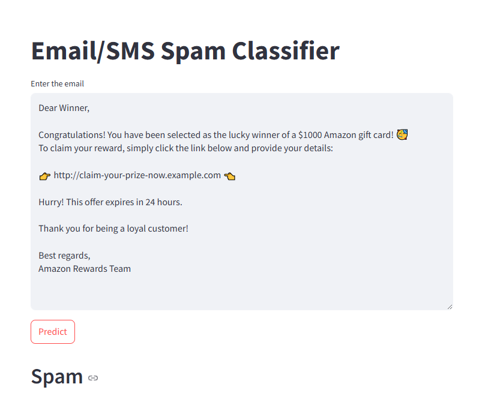
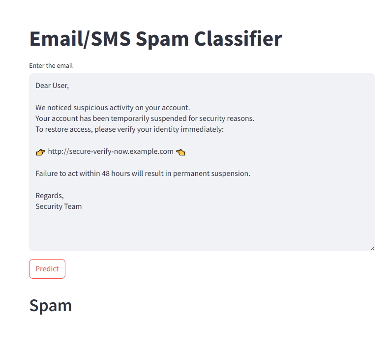
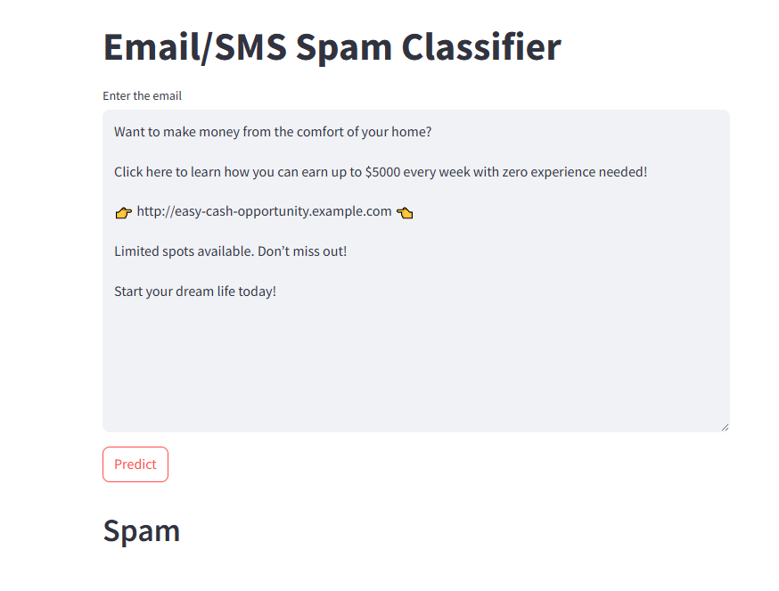
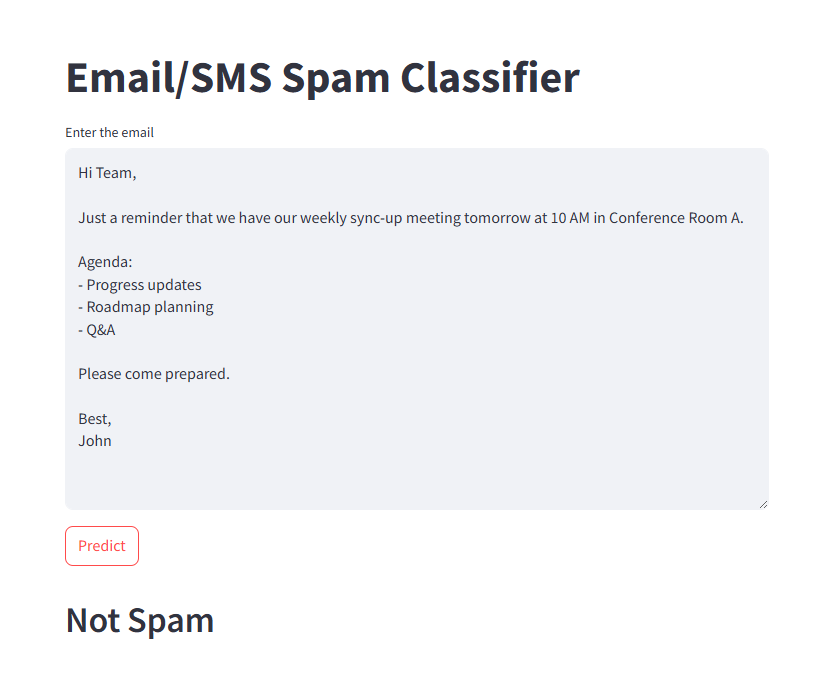
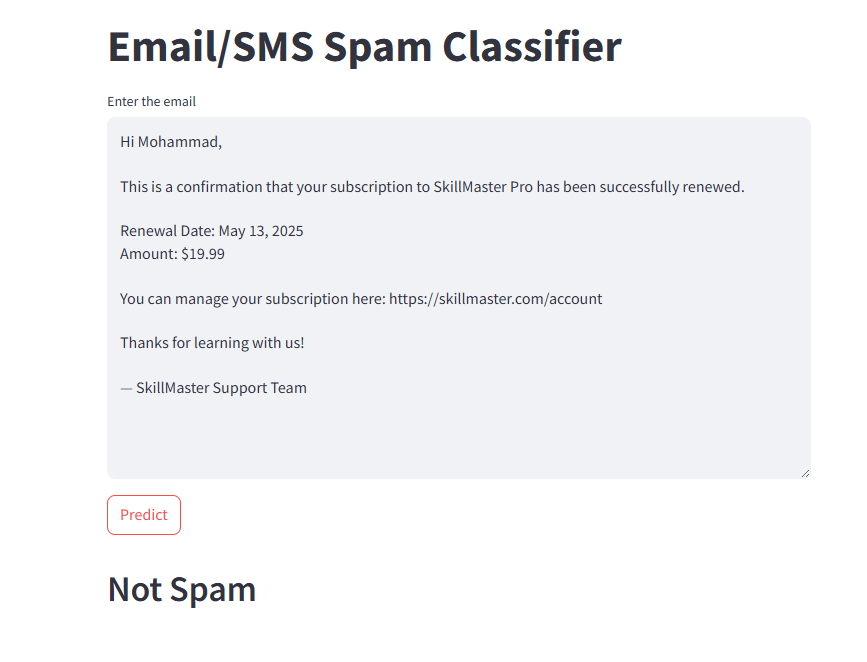

# 📧 Email Spam Detection using Python

This project implements a **Spam Email Detection System** using exploratory data analysis and preprocessing techniques in Python. It is designed to analyze email characteristics and lay the groundwork for building an effective machine learning pipeline for classifying emails as spam or ham (non-spam).

## 📌 Project Objectives

- Load and analyze real-world spam datasets.
- Perform preprocessing and feature engineering on email text data.
- Visualize patterns in spam and ham emails using histograms and other plots.
- Implement basic text transformation for NLP tasks.
- Prepare a foundation for machine learning-based spam classification.

## 🧰 Technologies Used

- **Python 3.12.8**
- **Jupyter Notebook**
- **Libraries:**
  - `Pandas` for data manipulation
  - `NumPy` for numerical operations
  - `Matplotlib` and `Seaborn` for visualizations
  - `NLTK` for natural language processing (tokenization)
  - `scikit-learn` (optional for future ML pipeline)

## 📁 Dataset Used

The project uses the following datasets:
- `completeSpamAssassin.csv` – Contains 6,046 emails labeled as spam or ham.
- `lingSpam.csv` – Alternative dataset for extended evaluation (not the focus of this project).

### Dataset Fields:
- `Unnamed: 0` – Index
- `Body` – Raw email content
- `Label` – Classification (1 = Spam, 0 = Ham)

## ⚙️ Installation and Setup

1. Clone this repository:
   ```bash
   git clone https://github.com/yourusername/email-spam-detection.git
   cd email-spam-detection
## Output:







#### Live Link: 
https://email-spam-detection-n801.onrender.com/


